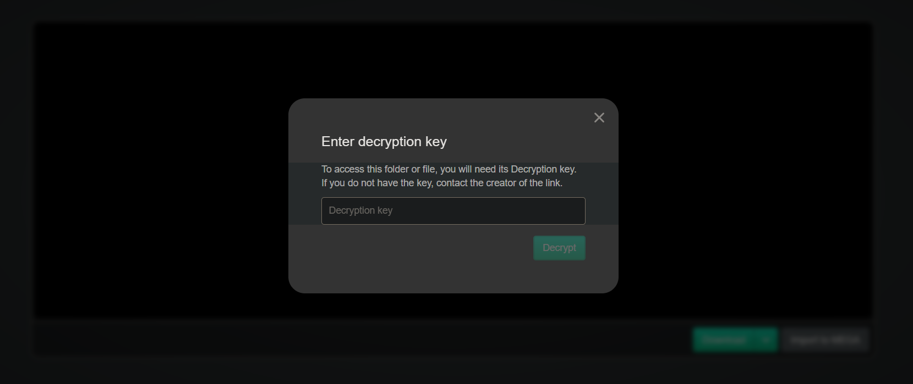
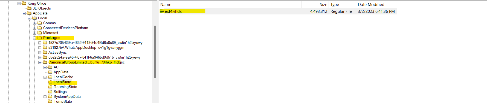

# Write up for The Betrayers

### Description:

An IT company provides a critical service to customers. One day, the service is attacked by DDoS. The Attack is originated from within the company's internal network, and that each compromised host was sending a large number of requests to the server.

The attack occurred shortly after the company installed a new patch to one of its core software programs. The new version is hosted by the Technical Director server!  

The host must be a specific web server not his server!!! The Technical Director is in trouble and he said that is not the attacker!

The strange thing is that the program is deleted directly after the blue team figure out the attack!

We need to get a release from that version and figure out how the attack occur!

### Write-up 

Ok Let's figure out what is happen. We get the disk image of the Technical Director system. The system that host the new program patch. (It must not be this one)

Let's start figure out what softwares are installed and check the history of the system. 


Oh as expected there is a mail software. It's thunderbird. We will check it later.


Let's Check the browsing history of the system and check what is going on here! We found Edge only here! 

Go to `C:\Users\Kong Office\AppData\Local\Edge\UserData\Default` and check the `History` database


After checking every single link and search. we found searchs about whatsapp desktop how to install it and official whatsapp download website is visited.


Thunderbird is installed for sure. But still no clue for whatsapp for now. Let's see what we have on the inbox now! It's time to check the mails! To check the inbox you can go to `C:\Users\Kong Office\AppData\Roaming\Thunderbird\Profiles\0ppw4tlt.default-release\ImapMail\imap.gmail.com` and investigate the `INBOX` file 


You can open the file using any text editor to check the mails but it's the worst way. you'll find the attachements encoded to base 64 and many trashy details 

You'll get an ugly view like this if you open it with vscode.


But you can choose any thunderbird inbox viewer available in the internet. I tried a random one and i got a better exeperience to understand what happen. 


Let's summerize what we found. One mail telling that the kubernetes cluster is updgraded successfully from the platform engineer, another one from a system adminstration telling the Technical Director about the security updates. Another one from `Securinets INSAT` asking for sponsorship to the National Cyber Security Congress! And the suspicision one is from a dummy mail `4n6nk8s@gmail.com`. In this mail we found a clue! 
A stranger tell the Technical Director about deploying a malicious binary and send a mega link! Ahhh Protected one


The link lead you to a wordlist that have strong and secure passwords. The mail talks about subsystem!! What a subsystem? Is it a `WSL` ??




and here we finished mail browser history and mail investigation. still the whatsapp thing! Where is whatsapp hide his data?? good question. Checking AppData don't help us. We didn't find any WhatsApp directory! 

After googling we found that there is some whatsapp version can store his data inside `%AppData%\Local\Packages`. Let's check that folder and Bingoo!! We found whatsapp directory! WhatsApp was installed here! Let's see what we can do here! 


You can find some conversation inside `messages.db` file. It might be encrypted and it might be decrypted. Let's try to open this database and see what we can find here!


I am chocked!! Two employees were behind all this!!
Two employees hate the director and they want to be in a trouble!

The attackers talks about encryption and subsystem password and they are shocked because the system is windows! and yes the mega decryption key is shared in this discussion. They send the mail to the director to make it in trouble!! 


Let's download that wordlist and check the powershell history commands! I am sure there is something there. Because I found Hyber-V directory in random place while investigating. The history is stored in `%userprofile%\AppData\Roaming\Microsoft\Windows\PowerShell\PSReadline\ConsoleHost_history. txt`


Yeah! Everything is cleared now! subsytem, subsystem! They are talking about WSL. WSL is installed here! and it used to host the malicious program! But what they does mean by encryption and the password. Mmmmm I guess we will face some cracking in the few next minutes! 

Let's check WSL now! Where is windows store the WSL? Just check `%userprofile%\AppData\Local\Packages` 



Let's mount this vhdx disk now in our Linux/WSL and check the files in this system. You can use `libguestfs-tools` to achieve this.

```bash
raf@4n6nk8s:~$ sudo apt-get install libguestfs-tools
```
Then, you can mount now the wsl disk image:


We found a user named `Kong` and have a home directory. Let's check his files and bash history! 


Let's start with `.bash_history` first. It's my number one rule! 


Wow! The attacker configure wsl.conf then install docker! Mmm He configure it to be boot with systemd!
Then he installed something called kind, After that he download `kubectl`! Kubectl??? Ah It's `Kubernetes` time!

But what is kind? Searching on it. I found that kind is Kubernetes inside Docker. It's a lightweight kubernetes cluster.

There is 3 yaml files. For sure there are worth to check! Let's see what is inside these files!

```yaml
### k-config.yaml content ####
kind: Cluster
apiVersion: kind.x-k8s.io/v1alpha4
networking:
  podSubnet: "10.244.0.0/16"
  serviceSubnet: "10.96.0.0/12"
  # the default CNI will not be installed
  disableDefaultCNI: false
           
nodes:
- role: control-plane
  # add a mount from /path/to/my/files on the host to /files on the node
  extraMounts:
  - hostPath: /etc/crio/crio.conf
    containerPath: /etc/crio/crio.conf
    # optional: if set, the mount is read-only.
    # default false
    readOnly: true
    # default false
    selinuxRelabel: false

  - hostPath: /etc/kubernetes
    containerPath: /etc/kubernetes
    # optional: if set, the mount is read-only.
    # default false
    readOnly: false
    # default false
    selinuxRelabel: false

  - hostPath: /var/lib/netcd
    containerPath: /var/lib/etcd
    # optional: if set, the mount is read-only.
    # default false
    readOnly: false
    # default false
    selinuxRelabel: false
- role: worker
  kubeadmConfigPatches:
  - |
    kind: JoinConfiguration
    nodeRegistration:
      kubeletExtraArgs:
        node-labels: "app-type=web-app"
  extraPortMappings:
  - containerPort: 30999
    hostPort: 80
    # optional: set the bind address on the host
    # 0.0.0.0 is the current default
    listenAddress: "0.0.0.0"
    # optional: set the protocol to one of TCP, UDP, SCTP.
    # TCP is the default
    protocol: TCP
```
It's a kind cluster configuration file!! This fiel is used to declare the specification of your cluster! And as you see `/etc/kubernetes` and `/var/lib/etcd` are mounted. We have 2-node cluster and a `extraPortMappings` to expose a service. In addition there is node-labels on the worker-node

> This challenge requires some kubernetes knowledge. You must be familiar with the basics of the kubernetes. Like nodes, deployements, pods, services, etc... 

```yaml
### content deploy.yaml ###
apiVersion: apps/v1
kind: Deployment
metadata:
  creationTimestamp: null
  labels:
    app: update-app
  name: update-app
spec:
  replicas: 1
  selector:
    matchLabels:
      app: update-app
  strategy: {}
  template:
    metadata:
      creationTimestamp: null
      labels:
        app: update-app
    spec:
      imagePullSecrets:
        - name: regcred
      containers:
      - image: medrafk8s/kubersex
        name: update-app
        resources:
          requests:
            memory: "64Mi"
            cpu: "250m"
          limits:
            memory: "128Mi"
            cpu: "500m"
      affinity:
        nodeAffinity:
            requiredDuringSchedulingIgnoredDuringExecution:
                nodeSelectorTerms:
                - matchExpressions:
                    - key: app-type
                      operator: In
                      values:
                      - web-app
                      - front-end
status: {}
```
This is a deployment manifest that pull a private image `medrafk8s/kubersex` using the imagePullSecrets fields! The nodeAffinity is used for some scheduling specification. In this example the deployment will be deployed in node with labels `app-type=web-app`

Let's summerize now! The attacker installed Kind to deploy the web app that hosts the malicious inside a kubernetes cluster! 

So our objective is to recover the webapp that contains the malicious binary! But how can we restore that container! It's a private container! What we should to do? 