# Introduction

This is a writeup for the Securinets Quals CTF 2023 possible challenge, which fits under the Forensics category. The challenge could be named The Setup by adm.

## Description

You have been recruited by a radical organization with a mission to take down a dangerous group of individuals. Your only lead is a disk image, perfectly captured in the dark of night. It is believed to contain recent intelligence that could help us cease their next raid, maybe even take them down for good this time. However, the exact nature of the information is unknown.

It is your job to delve into the depths of the disk image and uncover any useful information. This requires a keen eye and a methodical approach to find what could hurt the enemy; We really don't know what we're looking for, but we know that once you find it, you'll know its value.

The flag must be underscored and wrapped in the Securinets{...} format. Good Luck!

- Score: 500 pts (TBD)
- Category: Forensics (Disk and memory analysis)
- Solves: TBA
- Difficulty: Medium (TBD)

## Attachment

Given a disk image, `disk.img`. The disk image is a raw disk image, and can be investigated using FTK Imager.

- Size: 1.66 GB
- SHA256: TBD
- Date: 2023-02-12

# Writeup

The disk image is a raw disk image, and can be investigated using FTK Imager. The disk image contains a single partition, which is a Windows XP installation.

Looking at the root of the disk image, we can see a few interesting files:

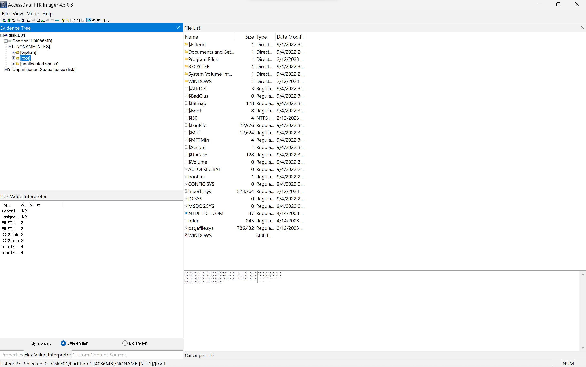

- `Documents and Settings` - Contains the user profiles of the system
- `Program Files` - Contains the installed programs
- `Windows` - Contains the Windows installation files
- `pagefile.sys` - The page file of the system, aka swap file, which holds the memory of the system when it is not in use or when it is not enough RAM to hold the memory of the system.
- `hiberfil.sys` - The hibernation file of the system, which contains the memory of the system when it is hibernated.

I must say these two files weighing together about 1.2 GB are very interesting. I will investigate them later.

- `System Volume Information` - Contains the shadow copies of the system, which is a backup of the system files. It is used to restore the system in case of a system failure. It is also used by the Windows Backup utility to create a backup of the system. It is also used by the Windows Restore utility to restore the system to a previous state. This folder is present in all disk images, people are usually not interested in it. However, it is very interesting in this case, as it contains a folder named `_restore{xxxxxx}`. This folder contains a file named `RPx`, this cleary a restore point of the system. I will investigate it later as well.

and the rest of the stuff that would really find in any Windows disk.

Let's start by taking a round of the system. I will start by investigating the user profile, as well as the installed programs.

The user profile is well cleaned, and there is nothing interesting in it. However, the installed programs are very interesting. There are a few programs installed.

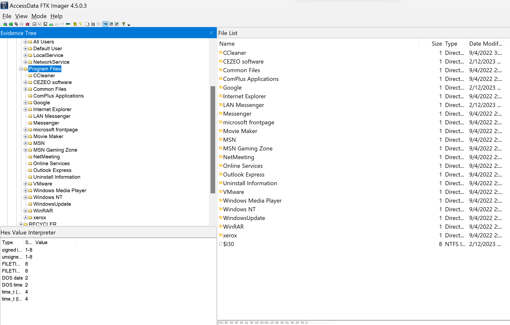

Maybe some of the essential ones like WinRar, Chrome, CCleaner, etc. However, there are a program that could lead to something, the LAN messenger. This program is very interesting, as it is a LAN messenger, which means it is used to communicate with other computers in the same network.

Let's find where its data is located!

And that's how we found our starting point:

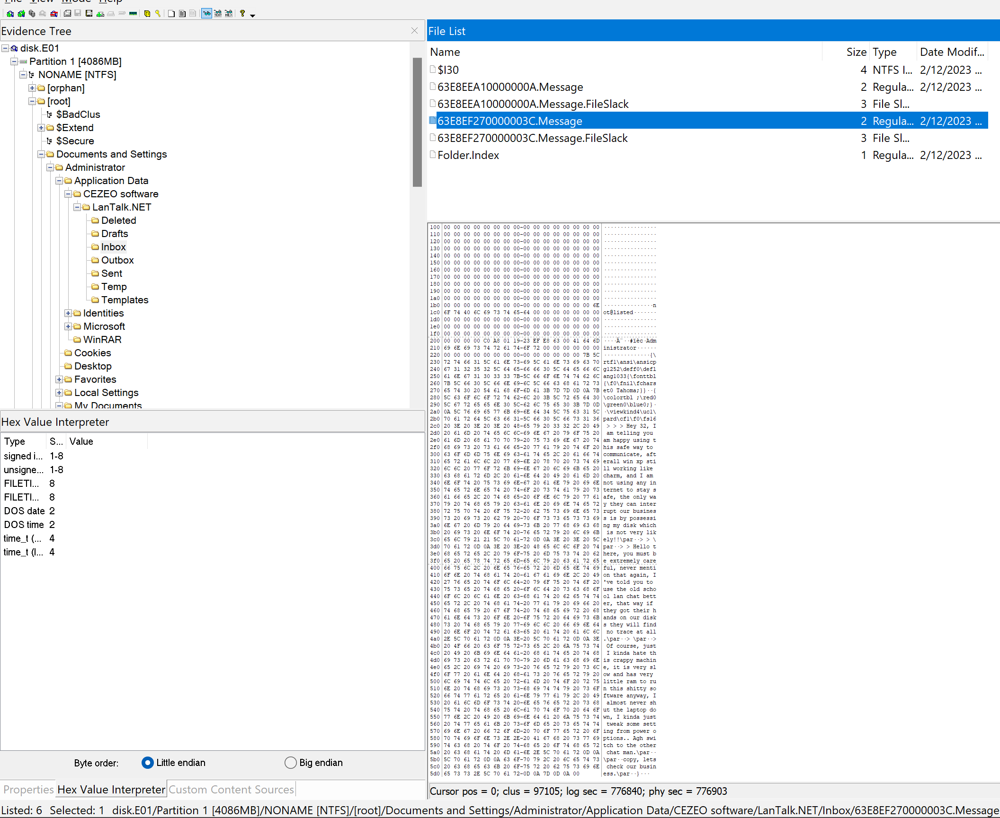

```
 > > > Hey 32, I am telling you am happy using this safe way to communicate,
 afterall win xp still working like charm, and I am not using any internet
 to stay safe, the only way they can interrupt our business is by possessing
 my disk which is not very likely!!\par
> > \par
> > Hello there, you must be extremely careful, never mention that again,
I've told you to use the old school lan chat better, that way if they got
their hands on our disks they will find no trace at all.\par
> \par
> Of course, just I kinda hate this crappy machine, it is very slow and has
very little ram to run this shitty software anyway, I almost never shut the
laptop down, I kinda just tweak some setting from power options.. Agh switch
to the other chat man.\par
\par
copy, lets check our business.\par
}
```

This confirms my theories about the two files that I found earlier. The `pagefile.sys` and the `hiberfil.sys` files. one of the parties in the chat indicated that the system rarely shuts down, but instead he turned on a feature from the power options to allow the machine to start faster. I bet he's talking about the hibernation feature. As Windows XP doesn't have any fast startup option like newer Windows systems.

The user also indicated that his machine is very slow, and has very little RAM. This is also a hint that the system is using the page file, which is a swap file, which means the system is using the hard disk as a RAM. This is a very bad practice, as it is very slow, and it is also a security risk, as the memory of the system is stored on the hard disk, which means it is not encrypted, and anyone can access it.

Keep that in mind, and let's further investigate the programs. I mentioned WinRAR, CCleaner, and Chrome. It is clear that the user is using the internet from time to time maybe and he is using CCleaner to clean his history and browsing data. Chrome can hold some secrets, let's check its data storage.

Well, look what we've found, Metamask is being used in Chrome. Metamask is a browser extension that allows you to use Ethereum. It is a very popular extension, and it is used by a lot of people. Metamask gives you a wallet address, and you can use it to send and receive cryptocurrencies whether in the Ethereum network, BSC network, or custom networks.

Metamask Extension for Chrome

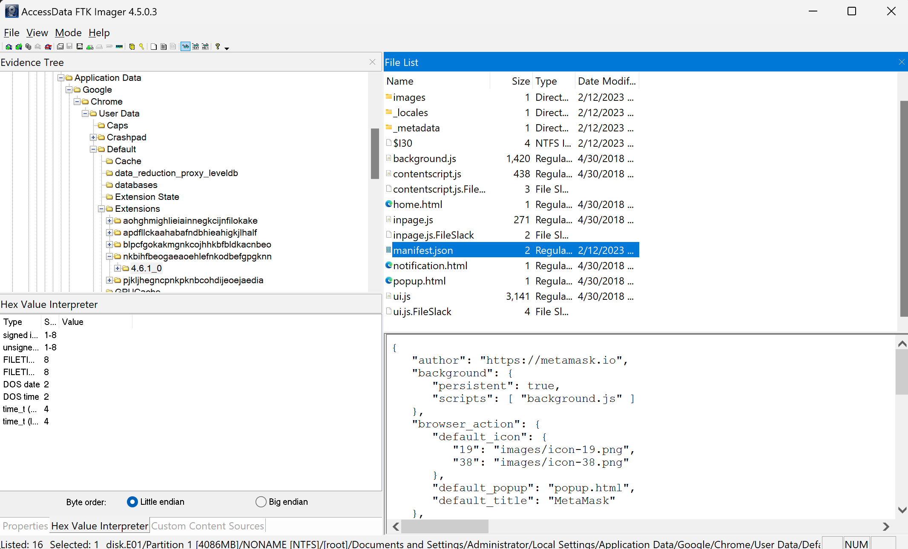

Could there be an active wallet within Metamask? Let's check it out.

Usually the extension data is stored within the 'Local Extension Settings' folder. And as expected, that folder contains some interesting files.

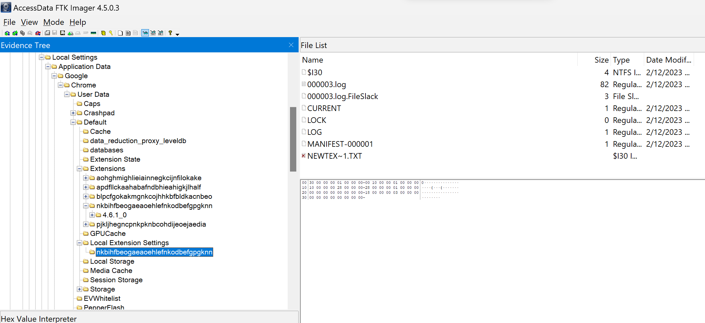

The `Local Extension Settings` folder contains a folder named `nkbihfbeogaeaoehlefnkodbefgpgknn`, which is the ID of the Metamask extension. This folder contains a file named 000003.log, which is a log file. Let's check it out.

According to this [Ethereum Stackexchange question](https://ethereum.stackexchange.com/questions/52658/where-does-metamask-store-the-wallet-seed-file-path). We could be able to completely control the existing wallet if we have the password. Could the challenge be all about that? and how to get the wallet password?

With every detail covered in the program, let's focus on the last part of the LAN chat, where the parties agreed to move to their legacy/old school chat.

What could they mean? I didn't find any other chat program installed on the system. Neither on Chrome history obviously.

Is it the time, to investigate the `_restore{xxxxxx}` folder? or the `pagefile.sys` and `hiberfil.sys` files?

Let's learn more first about the hiberfile.sys file because it seems the largest file and the most interesting one since it contains a snapshot of the whole memory of the system. This brings Volatility to my mind, I know we are not dealing with a RAM memory dump, but I think it could help here, since it is exactly the same content of the RAM at the time of hibernation copied to that file, using the same address mapping. Makes sense right?

Googling a bit, I found this (Superuser question)[https://superuser.com/questions/660649/how-to-read-windows-hibernation-file-hiberfil-sys-to-extract-data] and it says that if we convert the hiberfile.sys file to a raw image, we can use Volatility to analyze it!

and this is the command to use, as indicated:

```bash
vol -f hiberfil.sys --profile WinXPSP3x86 imagecopy -O hiberfil.raw
```


Excellent, lot of dots there, but I hope now we can use Volatility to analyze the hiberfil.raw file. Let's start by checking the processes and commands history.

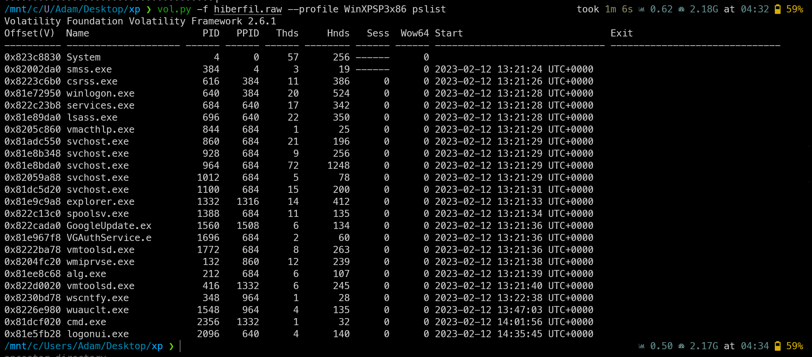

`cmd.exe` is there, we are on the right track, let's keep going

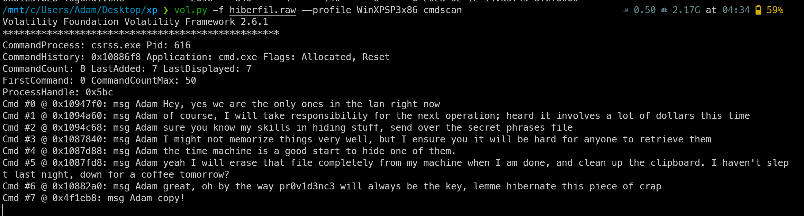

```
Cmd #0 @ 0x10947f0: msg Adam Hey, yes we are the only ones in the lan right now
Cmd #1 @ 0x1094a60: msg Adam of course, I will take responsibility for the next operation; heard it involves a lot of dollars this time
Cmd #2 @ 0x1094c68: msg Adam sure you know my skills in hiding stuff, send over the secret phrases file
Cmd #3 @ 0x1087840: msg Adam I might not memorize things very well, but I ensure you it will be hard for anyone to retrieve them
Cmd #4 @ 0x1087d88: msg Adam the time machine is a good start to hide one of them.
Cmd #5 @ 0x1087fd8: msg Adam yeah I will erase that file completely from my machine when I am done, and clean up the clipboard. I haven't slept last night, down for a coffee tomorrow?
Cmd #6 @ 0x10882a0: msg Adam great, oh by the way pr0v1d3nc3 will always be the key, lemme hibernate this piece of crap
Cmd #7 @ 0x4f1eb8: msg Adam copy!
```

There we go, I can see what they meant by the legacy, old school chat. They were using `msg.exe` to communicate with each other. This is a very old program, and it is used to send messages to other users in the same network. It is very similar to the LAN messenger that we found earlier, but it is a command line program. `msg` can also be used to transmit files as well.

I see three main focus points in here. Our guy is good at hiding stuff, but bad at memorization. We are dealing with secret phrases which indicate that the metamask wallet found earlier relates to this. However, it was plural which means there are more than one wallets of this kind. The time machine thing, that is for sure proving the restore point thing. And the last one is the key, which is the `pr0v1d3nc3`. I think this is the password of the metamask wallet.

Our guy is lazy and lacking sleep could he probably forgot about deleting the file, or cleaning the clipboard? As I see, he just hibernated the system and went afk. We will check the clipboard history for sure, but before that let's proceed with the metamask wallet we have in Chrome since, we have the password now.

Remember that Ethereum stack exchange question I mentioned earlier? here is the link again [https://ethereum.stackexchange.com/questions/52658/where-does-metamask-store-the-wallet-seed-file-path](https://ethereum.stackexchange.com/questions/52658/where-does-metamask-store-the-wallet-seed-file-path).

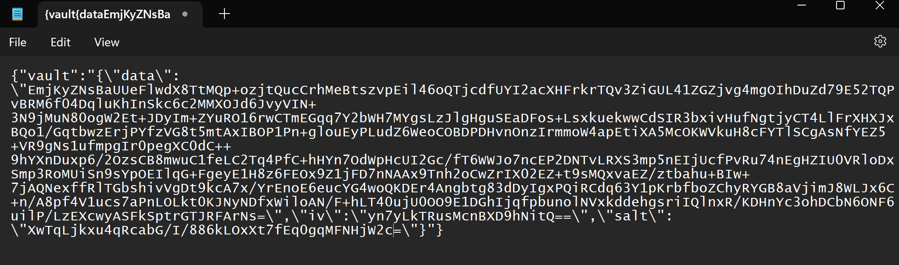

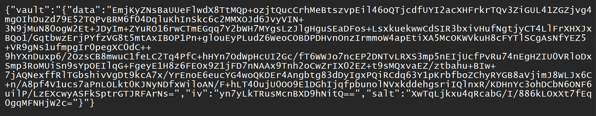

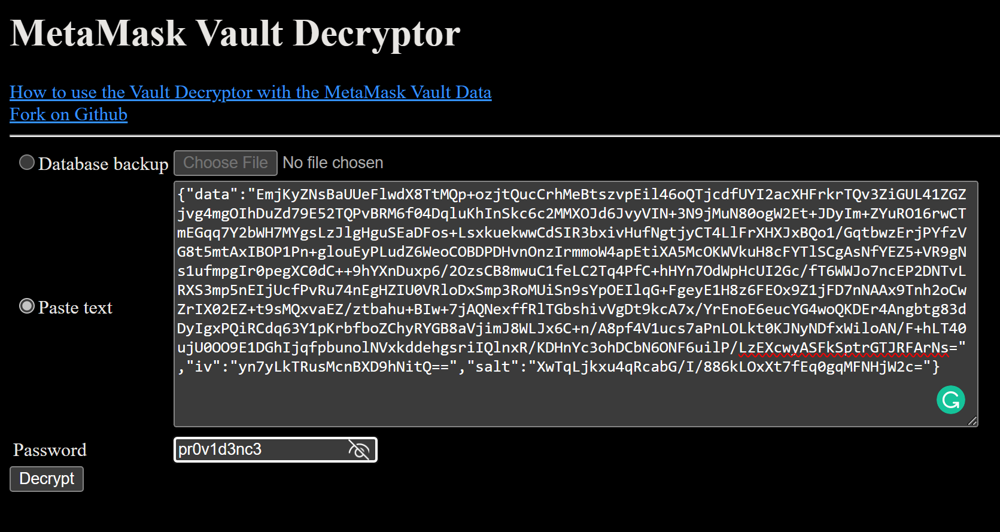

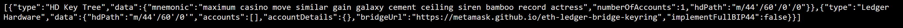

Done, we have some critical information here. The seed phrase! this should be one part of the flag! `maximum_casino_move_similar_gain_galaxy_cement_ceiling_siren_bamboo_record_actress`

Let's check the clipboard history. It might be within the `hiberfile` or the `pagefile`. Windows XP and 7 I believe, store clipboard data in the pagefile rather than the memory itself when it was cut from notepad as far I know, and unless you disable paging, the clipboard data will live there instead of the RAM mainly.

So, we are dealing with a Metamask seed phrases and if you don't know what those are, they are just 12 to 24 words that are used to recover your wallet. You can use them to recover your wallet in case you lose your password or your device. You should never share them publicly. They are the most important thing in your wallet, and you should keep them safe.

Let's check the hiberfile first using the clipboard plugin

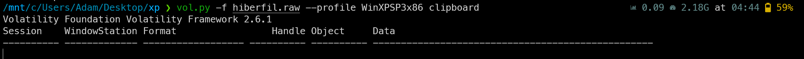

And nothing came up, as I said earlier, the clipboard data is stored in the pagefile, the hiberfile is just a copy of RAM when hibernating the system and we know the clipboard wont be there anyways.

Let's check the pagefile now.

You must know that the pagefile, unlike hiberfile is not a mapped address space, it has its own architecture and it varies from one system to another. It might be a hustle to find this piece of data, maybe grepping clipboard or putting together a regex to find 12 words seperated by a space. However, do you think Windows will actually store that data 12 words in a row? I don't think so, it will be a mess. Maybe we try the clipboard thing and try to adjust what we find.

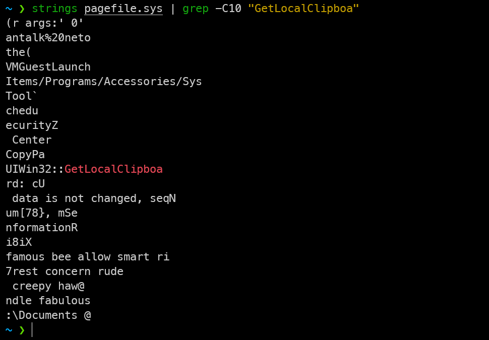

This may sound weird, since the function itself is lacking a letter `UIWin32::GetLocalClipboa`

I can see the following, `famous_bee_allow_smart_rip_rest_concern_rude_creepy_hawk_handle_fabulous`

I had to adjust rip, hawk and handle. I hope they were obvious to you as well?

We don't know exactly how many seed phrases like these are there nor how to order them, but the only spot left is the restore point thing, we can make use of a VM, however (OP: says the disk must not be converted back to vmdk whether by using a different file format or breaking the boot files). This way we can't use a VM to check the restore point. So, we have to do it manually. My idea is to spin my own Windows XP on VMware, you can get the ISO officially by Microsoft with serial number from the WayBackMachine SP3 and x86 of course. After that we create a dummy restore point and modify its files by copying the RP folders from `System Volume Information` and then we can proceed to perform a restore point to see what is inside. I hope you can understand what I mean here.

(OP Note: for order I guess I will accept any provided order or make the user follow the order as shown in the leaked chat.)

Let's do it.

- Spinning a new Windows XP machine with a 4GB hard disk

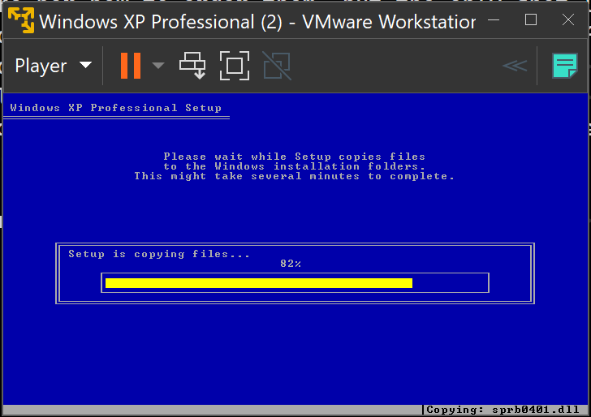

- Creating a dummy restore point or just get the disk UUID, anyways we need Windows to create a restore point folder for us, so let's do it.

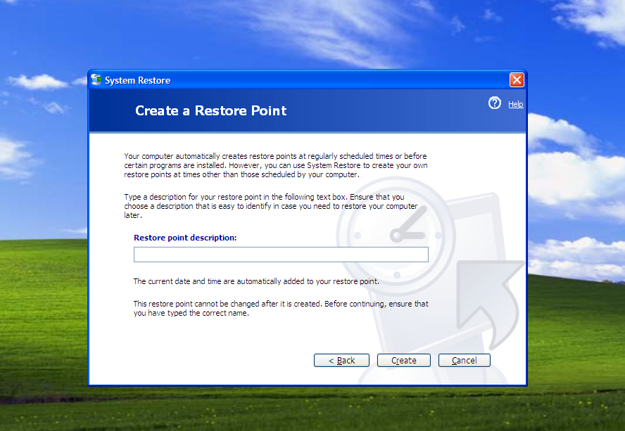

- Copying the RP folders from the Disk image `System Volume Information` to the new VM's `System Volume Information`

Export the restore folder from System Volume Information to your desktop or some folder.

Adjust these folder options on Windows XP VM

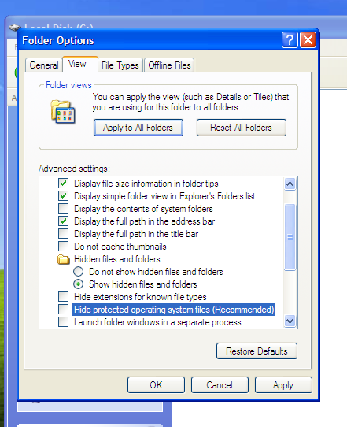

Then use this command to gain access to the System Volume Information folder

```powershell
cacls "C:\System Volume Information" /E /G Administrator:F
```

It can be administrator, Everyone or your specific VM username.

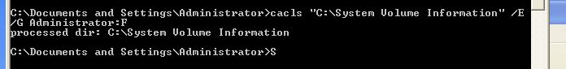

Then copy the restore folder contents to the System Volume Information folder

This is the current dummy restore point we made

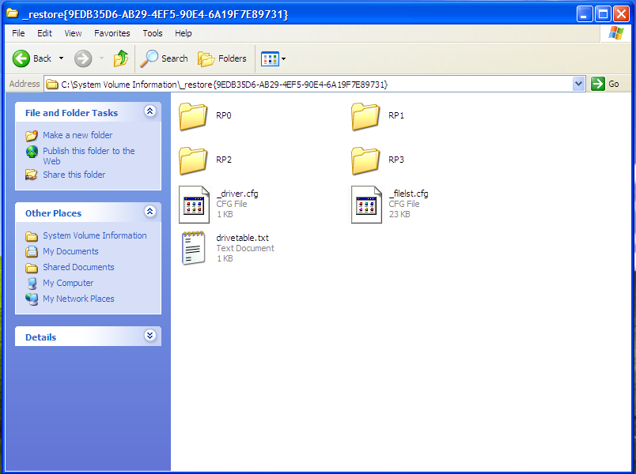

We add the exported RP5 and RP6 folders from the disk image with them

In each of the folders there is a `drivetable.txt` file that contains the old disk UUID, we need to replace it with the new one.
  
- Modifying Disk UUID in the restore point

You can also modify the `domain.txt` since it contains the old user-id but I believe the Restore point utility can very much detect the change.

- Restoring the system like if it was a real restore point we made.

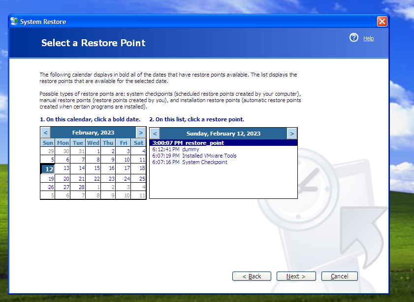

I can see a new entry added called "restore_point", so let's proceed with it!

This is the domain thing, hit 'OK'

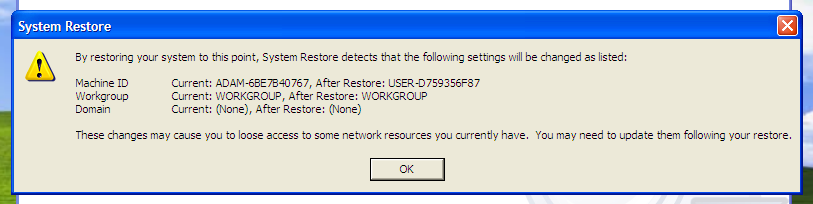

We wait for a quick restart.

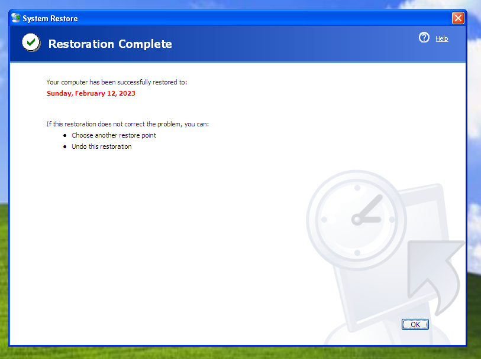

And that's my friends, is a success!

PS. I've tried some tools to explore restore point but luckily they don't work with Windows XP, they require 7 and newer. That's why you need to proceed manually, or somehow get the disk working on VMware. Other ways would be unintended, I hope there aren't any...

The word "key" was mentioned in the chat, key is a very general term, if it is just the password of the Metamask wallet, then why didnt they user use password instead, rather he said "pr0v1d3nc3 will always be the key". Could this mean that we should check a key in the Registry Editor maybe named pr0v1d3nc3? I don't know, but I will check it anyways.

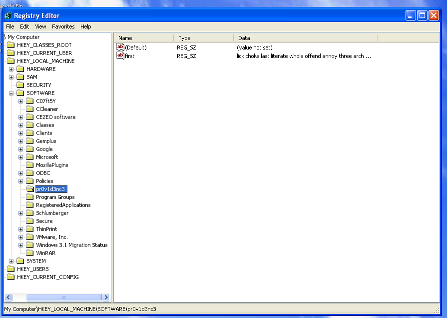

And there we go, a key named pr0v1d3nc3 containing a string named first that in turn contains a seed phrase. I think this should be the start of the flag as it was named first.

`lick_choke_last_literate_whole_offend_annoy_three_arch_wakeful_frog_carriage`

Which makes the Metamask wallet seed phrase second because the last step was cleaning up the clipboard.

Nowhere else to look, I guess we've finished this challenge and the final flag should be:
**Securinets{lick_choke_last_literate_whole_offend_annoy_three_arch_wakeful_frog_carriage_maximum_casino_move_similar_gain_galaxy_cement_ceiling_siren_bamboo_record_actress_famous_bee_allow_smart_rip_rest_concern_rude_creepy_hawk_handle_fabulous}**

Thanks for reading, I hope you enjoyed it. I will be happy to hear your feedback and suggestions.

# Idea and Final Words

I just wanted to use pagefile.sys, hiberfile.sys, the Metamask thing, and Restore points because nobody used them like this in a CTF. So I don't know if that's a great thing or rather will make players frustrated. Yet, I've tried to make everything as clear as possible for the players to understand and enjoy the challenge as a whole.

Btw, Time machine is like the Apple way to name restore points :)
Greetings from Providence, if you are a Hitman fan!

Forgot to say, nobody should ever use those wallets xD
adm.
